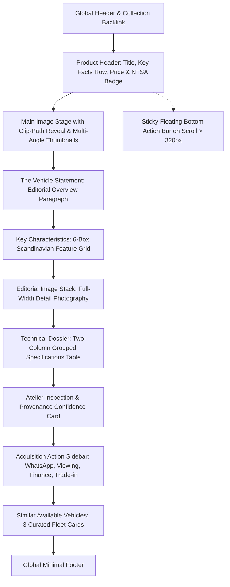

# Vehicle Detail Page Redesign Specification
## CAKE Makka Work Inspired Scandinavian Product Layout
**Target Entity:** Range Rover & Land Rover Centre · Nairobi  
**Example Target Vehicle:** `vehicle-detail.html?car=land-rover-discovery-4-2011-sdv6-hse`  
**Reference Inspiration:** [CAKE Makka Work Product Page](https://ridecake.com/en/p/makka-work)  

---

## 0. Purpose & Creative Directives

This specification details the transition from a standard dealership car listing into a **minimalist, Scandinavian, product-first automotive dossier** inspired by CAKE’s Makka Work digital product presentation.

### Core Scandinavian Design Principles Borrowed:
1. **Pristine White & Bone Canvas (`#FFFFFF` / `#FBFBF9`):** Removing dense visual boxes and heavy dark containers in favor of expansive, airy breathing room.
2. **Sticky Floating Purchase / Action Bar:** Slides up smoothly as the user scrolls past the hero, keeping price, vehicle title, and WhatsApp/enquiry triggers pinned within effortless thumb/click reach.
3. **Key Facts Telemetry Header:** `Year · Mileage · Engine · Transmission · Seats` cleanly formatted below the display title.
4. **Key Characteristics 6-Box Feature Grid:** Minimalist feature modules with green tag badges, concise headlines, and focused descriptions.
5. **Full-Bleed Editorial Image Stack:** Consecutive high-resolution photography frames revealing exterior profile, wheel architecture, and cabin craftsmanship.
6. **Technical Specification Dossier:** Grouped key-value tables covering powertrain, dimensions, comfort, and verified provenance.

---

## 1. Page Architecture & Section Hierarchy

---

## 2. Section-by-Section Engineering Details

### 2.1 Product Header & Key Facts Bar
- **Display Title:** Large display serif/sans typography (`data-detail="name"`).
- **Subtitle / Trim:** Minimalist edition label (`data-detail="subtitle"`).
- **Price Block:** Large monospace numerical pricing (`data-detail="price"`) + `Ready for NTSA Transfer` badge.
- **Key Facts Row:**
  - `Year: 2011`
  - `Mileage: 45,000 KM`
  - `Fuel: Diesel`
  - `Transmission: Automatic`
  - `Warranty: 6 Months Atelier`

### 2.2 Interactive Stage & Editorial Gallery
- **Primary Stage:** Aspect ratio `16:10` with `clip-path` wipe reveal and fullscreen lightbox click.
- **Thumbnail Strip:** Smooth horizontal track with active thumbnail indication.
- **Editorial Stack:** 2 full-width stacked image frames showing profile and interior close-up.

### 2.3 Key Characteristics Grid (6-Box Architecture)
1. **Drivetrain:** Permanent 4WD & Terrain Response (Pneumatic height-adjustable air suspension).
2. **Seating:** 7 Full-Size Stadium Seats (Three-row elevation with independent climate controls).
3. **Powertrain:** SDV6 Twin-Turbo Diesel (600 Nm peak low-end pulling torque).
4. **Acoustics:** Harman Kardon LOGIC7 Sound Stage (14-speaker high-fidelity acoustic sound).
5. **Audit:** 120-Point Atelier Diagnostic Audit (Zero fault codes across ECU and modules).
6. **Transfer:** Immediate NTSA Logbook Transfer (Clean title deed and duty clearance).

### 2.4 Technical Specifications Dossier
Two-column clean tabular data:
- Engine / Displacement: `3.0L SDV6 Twin-Turbo Diesel / 2993cc`
- Power & Torque: `241 HP / 600 Nm`
- Odometer: `45,000 KM (Verified)`
- Transmission: `6-Speed ZF CommandShift Automatic`
- Drivetrain: `Permanent 4WD / Electronic Air Suspension`
- Exterior Paint: `Santorini Black Metallic / HSE Bright Pack`
- Interior Leather: `Almond & Arabica Windsor Leather`
- VIN / Chassis: `Verified & Clean`
- Logbook: `Ready for Transfer`
- Warranty: `6 Months Atelier Warranty`

### 2.5 Sticky Bottom Action Bar (CAKE Makka Work Signature)
- **Position:** `position: fixed; bottom: 0; left: 0; right: 0;`
- **Trigger:** Reveals via `transform: translateY(0%)` once `window.scrollY > 320px`.
- **Contents:**
  - Left: Thumbnail image (`52px × 36px`), Vehicle Name, Price.
  - Right: `Schedule Viewing` (outline button) + `Enquire on WhatsApp` (primary green CTA with prefilled stock reference).

---

## 3. Data Integration & Dynamic Routing

All vehicle detail pages dynamically hydrate from `window.RRC_VEHICLES` using the URL parameter `?car=[slug]`:
- `vehicle-detail.html?car=land-rover-discovery-4-2011-sdv6-hse`
- `vehicle-detail.html?car=range-rover-autobiography-sv`
- `vehicle-detail.html?car=defender-110-v8-carpathian`
- `vehicle-detail.html?car=range-rover-sport-first-edition`
- `vehicle-detail.html?car=range-rover-velar-hse-r-dynamic`
- `vehicle-detail.html?car=land-rover-discovery-5-hse-luxury`
